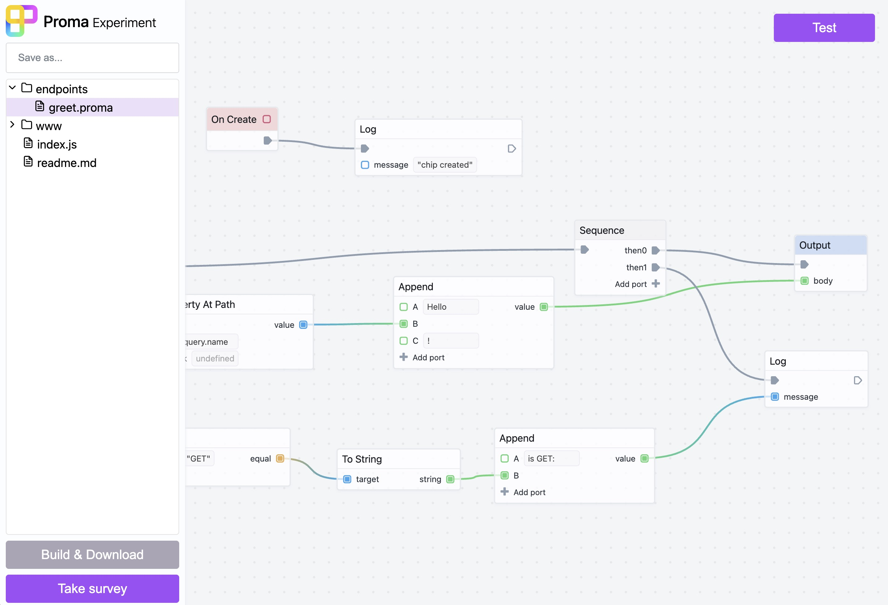

# Proma

A visual programming language for JavaScript inspired by Unreal Engine Blueprints. Proma enables node-based visual scripting that compiles to executable JavaScript.



## Overview

Proma is a monorepo project consisting of three main packages:

- **[proma-core](packages/proma-core)** - The core compiler and runtime engine for the visual programming language
- **[proma-svelte-components](packages/proma-svelte-components)** - Reusable Svelte components for building visual node editors
- **[proma-web](packages/proma-web)** - A full-stack web application for creating and running Proma projects

## What is Proma?

Proma allows you to write programs using a visual node-based interface similar to Unreal Engine Blueprints:

- **Chips** are the fundamental building blocks (like nodes in other visual programming systems)
- **Ports** are inputs and outputs on chips, handling both data flow and execution flow
- **Wires** connect ports to create program logic
- The visual program compiles to clean, executable JavaScript

## Quick Start

### Prerequisites

- Node.js (v14 or later)
- pnpm (install with `npm install -g pnpm`)

### Installation

```bash
# Clone the repository
git clone <repository-url>
cd proma

# Install dependencies
pnpm install

# Bootstrap the monorepo (builds all packages)
pnpm bootstrap
```

### Running the Web Application

To run the full web application locally:

```bash
# Navigate to proma-web
cd packages/proma-web

# Setup local DynamoDB (first time only)
pnpm setup

# Start the backend (serverless offline) - Terminal 1
pnpm dev:backend

# In a separate terminal, build and serve the frontend - Terminal 2
pnpm dev:frontend
```

The application will be available at:
- **Frontend:** http://localhost:3000
- **Backend API:** http://localhost:3000/dev

See the [proma-web README](packages/proma-web/README.md) for detailed setup instructions including Auth0 configuration.

### Using the Playground

For quick experimentation without backend setup, use the offline playground:

```bash
cd packages/proma-web
pnpm serve
# Navigate to http://localhost:3000/playground
```

## Project Structure

```
proma/
├── packages/
│   ├── proma-core/              # Core compiler and runtime
│   │   ├── core/                # Source code
│   │   │   ├── api.mjs          # Public API
│   │   │   ├── chip.mjs         # Chip class and ChipInfo
│   │   │   ├── compile.mjs      # JavaScript compiler
│   │   │   ├── run.mjs          # Runtime execution
│   │   │   ├── library/         # Standard library chips
│   │   │   └── ...
│   │   └── dist/                # Built package
│   ├── proma-svelte-components/ # UI components
│   │   ├── src/
│   │   │   ├── board/           # Node editor board component
│   │   │   ├── views/           # Complete editing views
│   │   │   ├── inputs/          # Input controls
│   │   │   └── ui/              # UI utilities
│   │   └── dist/                # Built package
│   └── proma-web/               # Web application
│       ├── frontend/            # Svelte frontend
│       │   ├── src/
│       │   │   ├── routes/      # App pages
│       │   │   └── lib/         # Components and utilities
│       │   └── public/          # Static assets
│       └── backend/             # Serverless backend
│           ├── src/             # Lambda functions
│           └── serverless.yml   # AWS configuration
├── pnpm-workspace.yaml          # Workspace definition
└── package.json                 # Root package
```

## Development

### Available Commands

```bash
# Root level commands
pnpm bootstrap       # Install and build all packages
pnpm lint           # Check code formatting
pnpm format         # Auto-format code

# Package-specific commands (run from package directory)
pnpm build          # Build the package
pnpm test           # Run tests (proma-core)
pnpm dev            # Start development server
```

### Working with Packages

The packages have the following dependencies:

- `proma-svelte-components` depends on `proma-core`
- `proma-web` depends on both `proma-core` and `proma-svelte-components`

When making changes to `proma-core` or `proma-svelte-components`, rebuild them for changes to be reflected in `proma-web`:

```bash
cd packages/proma-core
pnpm build

cd ../proma-svelte-components
pnpm build

cd ../proma-web
pnpm dev:frontend  # This will pick up the changes
```

## Key Concepts

### Chips

Chips are the building blocks of Proma programs. They can be:

- **Pure chips** - Compute values without side effects
- **Flow chips** - Contain execution logic with flow ports
- **Event chips** - Respond to events
- **Composite chips** - Contain other chips for reusability

### Ports

Four types of ports:

- **Input Flow** - Execution entry points
- **Output Flow** - Execution continuation
- **Input Data** - Data inputs
- **Output Data** - Data outputs (can be computed)

### Libraries

Proma includes three standard libraries:

- **proma/std** - Standard utilities (logging, control flow, data manipulation)
- **proma/web** - Browser APIs (DOM, fetch, events)
- **proma/node** - Node.js APIs (file system, HTTP)

### Compilation

Visual programs compile to JavaScript:

1. Chip graph is analyzed
2. JavaScript AST is generated using Recast
3. Code is optimized (inlining, dead code elimination)
4. Output is an executable JavaScript class

## Architecture

### proma-core

The engine that powers the visual language:

- **Compiler** - Transforms chip graphs into JavaScript
- **Runtime** - Executes compiled code with scope management
- **Type System** - Rich type checking and inference
- **Registry** - Manages available chips and libraries
- **Serialization** - Save/load chip graphs as JSON
- **Edit API** - Live editing of chip graphs

### proma-svelte-components

Reusable UI components:

- **Board** - The main node editor with pan/zoom, drag-and-drop, and wire drawing
- **Chip** - Visual representation of individual chips
- **Port** - Port visualization with type-based coloring
- **Wire** - Connection visualization between ports
- **Input Controls** - Type-specific input components

### proma-web

Full-stack application:

- **Frontend** - Svelte SPA with visual editor
- **Backend** - AWS Lambda serverless functions
- **Database** - DynamoDB for projects and users
- **Storage** - S3 for project files
- **Auth** - Auth0 for authentication

## Deployment

### Backend (AWS)

```bash
cd packages/proma-web
pnpm build:backend
pnpm deploy:backend
```

### Frontend

```bash
cd packages/proma-web
pnpm build:frontend
pnpm deploy:frontend
```

See [proma-web README](packages/proma-web/README.md) for AWS configuration details.

## Examples

### Creating a Simple Chip

```javascript
import { chip, inputData, outputData } from '@proma/core';

const Greeting = chip('Greeting', () => {
  const name = inputData('name', { canonical: true });
  const message = outputData('message', () => `Hello ${name()}!`);
});

// Use the chip
const greeter = new Greeting('World');
console.log(greeter.message); // "Hello World!"
```

### Using the Board Component

```svelte
<script>
  import { Board } from '@proma/svelte-components';

  let chipBoard; // Your ChipInfo instance
  let selectedChips = [];
</script>

<Board
  {chipBoard}
  bind:selectedChips
  on:wire:end={handleWireConnection}
/>
```

## Contributing

1. Fork the repository
2. Create a feature branch
3. Make your changes
4. Run tests and linting: `pnpm lint && pnpm test`
5. Submit a pull request

## License

[Add license information]

## Resources

- [proma-core Documentation](packages/proma-core/README.md)
- [proma-svelte-components Documentation](packages/proma-svelte-components/README.md)
- [proma-web Documentation](packages/proma-web/README.md)

## Current Status

Proma is under active development. Current features:

- ✅ Visual node editor with drag-and-drop
- ✅ Compilation to JavaScript
- ✅ Runtime execution
- ✅ Type system with type checking
- ✅ Standard library of chips
- ✅ Project save/load functionality
- ✅ Serverless backend with API
- 🚧 Chip property editing UI (in progress)
- 🚧 Enhanced debugging tools (in progress)
- 🚧 Error visualization in board (in progress)

See the WIP section in the code for upcoming features and ideas.
