# proma-core Technical Documentation

## Table of Contents

1. [Overview](#1-overview)
2. [Chip Model](#2-chip-model)
3. [Type System](#3-type-system)
4. [Compiler Pipeline](#4-compiler-pipeline)
5. [Runtime](#5-runtime)
6. [Edit API](#6-edit-api)
7. [Serialization](#7-serialization)
8. [Standard Library](#8-standard-library)
9. [Architecture Diagram](#9-architecture-diagram)
10. [Current Limitations & Open Questions](#10-current-limitations--open-questions)

---

## 1. Overview

**proma-core** is the core engine of Proma, a visual programming language that compiles to JavaScript. It provides:

- A **chip model** for defining reusable computation units with typed ports
- A **dual-flow execution model** combining data flow (functional/reactive) and execution flow (imperative sequencing)
- A **compiler** that transforms a chip graph into a standalone JavaScript class using Recast (an AST manipulation library)
- An **interpreter/runtime** for direct execution without compilation
- A **serialization format** (JSON-based `.proma` files) for persisting visual programs
- An **edit API** for live manipulation of chip graphs with an event system

The package lives at `packages/proma-core/` and exposes its public API from `core/index.mjs`:

```javascript
export { Chip } from './chip.mjs';
export * from './api.mjs';
export * as library from './library/index.mjs';
export { registry } from './registry.mjs';
export { edit } from './edit.mjs';
export { fromJSON } from './deserialize.mjs';
export { debug } from './debug.mjs';
```

### High-Level Architecture

A Proma program is a **composite chip** -- a chip whose body contains other chips wired together through ports. The chip definition produces both a runtime class (directly instantiable and executable) and a compilable unit (that can produce a standalone JS class). The core tension in the design is between two execution paradigms:

- **Pure/flowless chips**: Data flows through connected ports; outputs are computed from inputs without explicit sequencing. Think spreadsheet cells.
- **Flow chips**: An imperative execution flow (like Unreal Engine's Blueprints) sequences operations via `exec`/`then` ports, allowing side effects, state mutation, and async operations.

---

## 2. Chip Model

### 2.1 The `chip()` Factory Function

Chips are defined using the `chip()` factory function from `core/api.mjs`. This function uses a **context stack** pattern: during the `build` callback, top-level calls to `inputFlow()`, `inputData()`, `outputFlow()`, `outputData()`, and `wire()` operate on the current chip being defined.

```javascript
const MyChip = chip('my/namespace/MyChip', () => {
  const exec = inputFlow('exec', () => {
    const val = input();
    output(val * 2);
    then();
  });
  const input = inputData('input', { canonical: true, type: 'number' });
  const then = outputFlow('then');
  const output = outputData('output', { type: 'number' });
});
```

**File**: `core/api.mjs` -- `makeChipFactory()`

The `chip()` function internally:
1. Creates a `ChipInfo` instance (the private metadata)
2. Pushes it onto the context stack
3. Calls the `build` function, which populates ports, sub-chips, and wires
4. Pops the context
5. Returns a class extending `ChipBase` (the `Chip` class from `core/chip.mjs`)

The returned class has both instance methods (`compile()`, `destroy()`) and static methods (`compile()`, `toJSON()`, `compiledClass()`, etc.).

### 2.2 `plainChip` vs `chip`

There are two factory variants:

| Factory | File | Description |
|---------|------|-------------|
| `plainChip` | `core/api.mjs` | Bare chip factory with no lifecycle hooks |
| `chip` | `core/api.mjs` | Adds `OnCreate` and `OnDestroy` event chips as custom chip classes, plus `onCreate`/`onDestroy` hooks |

The `chip` factory provides `OnCreate` and `OnDestroy` as built-in custom chips that can be instantiated inside any chip's body. These map to constructor-time and `destroy()` lifecycle hooks.

### 2.3 ChipInfo (Private Metadata)

Every chip class, chip instance, port, and port outlet has a hidden `INFO` symbol property (defined in `core/utils.mjs`) that stores private metadata. The `info()` helper reads/writes this symbol.

```javascript
// core/utils.mjs
const INFO = Symbol('info');
export function info(obj, value) {
  if (typeof value === 'undefined') return obj[INFO];
  return Object.defineProperty(obj, INFO, { value, ... });
}
```

**`ChipInfo`** (in `core/chip.mjs`) holds:

| Property | Type | Description |
|----------|------|-------------|
| `URI` | `string` | Unique identifier like `"my/namespace/MyChip"` |
| `chips` | `Chip[]` | Sub-chip instances in the chip body |
| `inputs` | `PortOutlet[]` | Input port outlets |
| `outputs` | `PortOutlet[]` | Output port outlets |
| `sourceConnections` | `Map<port, port[]>` | Wires from source to sink(s) |
| `sinkConnection` | `Map<port, port>` | Wires from sink to source (1:1) |
| `registry` | `Registry` | Registry used for serialization |
| `chipLoaders` | `Map` | PlaceholderChip to loading promises |

The `name` getter sanitizes the URI into a valid JS identifier (replacing `/` and other chars with `_`).

### 2.4 Port System

Ports are the connection points on chips. There are four fundamental port types organized along two axes:

```
              Input (in)              Output (out)
           +-----------------------+------------------------+
  Flow     | InputFlowSource       | OutputFlowSink         |
  (exec)   | "exec", "bind"        | "then", "whenTrue"     |
           +-----------------------+------------------------+
  Data     | InputDataSink         | OutputDataSource       |
  (value)  | "input", "target"     | "output", "value"      |
           +-----------------------+------------------------+
```

**Source vs Sink terminology**: The naming is relative to the data/flow direction:
- **Source ports** produce values or initiate flow: input flow ports (they source execution) and output data ports (they source data)
- **Sink ports** consume values or receive flow: input data ports (they sink data) and output flow ports (they sink execution before continuing)

The `isSink` property is computed as `isFlow XOR isInput`.

#### Port Classes (in `core/ports.mjs`)

| Class | File | Description |
|-------|------|-------------|
| `Port` | `core/ports.mjs` | Instance-level port on a chip instance. Extends `Function` (callable). |
| `PortOutlet` | `core/ports.mjs` | Definition-level port on the chip class. Also extends `Function`. |
| `PortList` | `core/ports.mjs` | Proxy-based collection providing named access (`chip.in.exec`) |
| `PortInfo` | `core/ports.mjs` | Base class for port metadata |
| `VariadicPortInfo` | `core/ports.mjs` | Extends `PortInfo` with variadic support |

#### PortInfo Subclasses

| Class | Side | Kind | Source/Sink | Key Properties |
|-------|------|------|-------------|----------------|
| `InputFlowSourcePortInfo` | Input | Flow | Source | `execute`, `executeCompiler` |
| `OutputDataSourcePortInfo` | Output | Data | Source | `compute`, `computeCompiler`, `computeOn`, `inline`, `type`, `defaultValue`, `conceiled` |
| `InputDataSinkPortInfo` | Input | Data | Sink | `canonical`, `conceiled`, `defaultValue`, `type`, `variadic` |
| `OutputFlowSinkPortInfo` | Output | Flow | Sink | `computeOutputs` (Set of output data ports that update on this flow), `variadic` |

### 2.5 Port Modifiers

#### Canonical Ports

Canonical ports (`canonical: true` or `canonical: 'required'`) are input data ports whose values can be set via the chip constructor:

```javascript
const input = inputData('input', { canonical: true, defaultValue: 0 });
// Usage: new MyChip(42)  -- sets `input` to 42
```

Required canonical ports (`canonical: 'required'`) must be declared before optional ones.

#### Conceiled Ports

Conceiled ports restrict external connectivity:
- `conceiled: true` -- Port cannot be connected from outside but its value can be set
- `conceiled: 'hidden'` -- Port is completely inaccessible from the outside. Used for internal state or config.

The `inputConfig()` API helper creates a canonical + conceiled port:

```javascript
// Shorthand for: inputData(name, { canonical: true/required, conceiled: true })
export function inputConfig(name, { defaultValue, required } = {}) { ... }
```

#### Variadic Ports

Variadic ports can have a dynamic number of instances. Defined via the `variadic` config property:

```javascript
const input = inputData('input', { variadic: '{letter}' });
// Creates ports: inputA, inputB, inputC, ...

const then = outputFlow('then', { variadic: 'then{index}' });
// Creates ports: then0, then1, then2, ...
```

The `variadicStringNameToFunc()` function in `core/variadic.mjs` parses the pattern and returns a bidirectional mapping function: index-to-name and name-to-index.

Variadic ports are accessed through a Proxy-based `variadic` property on the `Port` instance. Accessing `port.variadic[n]` lazily creates the n-th variadic port instance.

#### Inline Control

Output data ports have an `inline` property controlling how the compiler handles their value:

| Value | Behavior |
|-------|----------|
| `undefined` | Auto-detect: inline literals and single-use values, use variables for blocks and multi-use |
| `true` | Always inline (duplicate computation at each usage site) |
| `false` | Never inline, use a function variable |
| `'once'` | Compute once and store in a `const` |

#### ComputeOn

Output data ports can be linked to output flow ports via `computeOn`:

```javascript
const then = outputFlow('then');
const output = outputData('output', then);
// `output` updates its value when `then` fires
```

When connecting an output data port in a chip with flow ports, the compiler automatically assigns `computeOn` to all preceding output flow ports if none is explicitly set.

### 2.6 Composite Chips and Sub-Chips

Chips are composed by instantiating other chips within a build function:

```javascript
const Parent = chip('Parent', () => {
  const exec = inputFlow('exec');
  const log = new Log('hello');          // sub-chip instance
  const then = outputFlow('then');
  wire(exec, log.in.exec);              // wire parent port to sub-chip port
  wire(log.out.then, then);             // wire sub-chip port to parent port
});
```

When a chip is instantiated inside a build context, it is automatically added to the parent's `ChipInfo.chips` array.

### 2.7 Special Chip Types

#### Event Chips

Created with `event(name, ...ports)` in `core/api.mjs`. An event chip produces a `handle` output (a function type) and a `then` output flow, plus any custom data outputs:

```javascript
const OnClick = event('OnClick', 'event:Event');
// Produces: out.handle (Function), out.then (flow), out.event (Event data)
```

The handle port outputs a function that, when called externally, pushes data to the output ports and triggers the `then` flow.

#### Switch Chips

Created with `switchChip(name, type)`. Provides `exec` input flow, `discriminant` input data, variadic `cases` input data, variadic `thens` output flows, and a `thenDefault` output flow. Includes a custom `executeCompiler` that generates a JS `switch` statement.

#### External References

`externalRef({ myVar })` creates an `ExternalReference` object that resolves to a runtime value by name. Used with `externalGet()` and `externalSet()` for bridging to external JavaScript values. The compiler emits the reference name as a bare identifier.

### 2.8 Placeholder Chips

When a chip is loaded asynchronously (e.g., via a registry resolver), a `PlaceholderChip` (`core/placeholder.mjs`) stands in temporarily. It:
- Holds the loading promise
- Provides proxy-based `PlaceholderPort` and `PlaceholderPortList` for connection before the real chip loads
- Once resolved, `ChipInfo.replaceChip()` swaps the placeholder with the real chip instance, remapping all connections

---

## 3. Type System

**File**: `core/types.mjs`

### 3.1 Type Signatures

Types are expressed as strings and parsed by a recursive-descent parser:

```
"String"                   -- primitive type
"Number | null"            -- union type
"[String]"                 -- array of strings
"{name: String, age: Number}" -- object type
"(String, Number) => Boolean" -- function type
"(String, Number)"         -- tuple type
"{name: String, ...}"      -- subset object (partial match)
"?String"                  -- nullable (expands to String | Null | Undefined)
"label:String"             -- labeled type
```

The `type(signature)` function parses a signature string and returns a cached `Type` instance.

### 3.2 Built-in Types

| Signature | Aliases |
|-----------|---------|
| `any` | `*` |
| `String` | `string` |
| `Number` | `number` |
| `Boolean` | `boolean` |
| `BigInt` | `bigint`, `bigInt` |
| `Symbol` | `symbol` |
| `Function` | `function` |
| `Null` | `null` |
| `Void` | `void` |

### 3.3 Type Matching

`Type.match(otherType)` checks if the other type is compatible:
- `any` matches everything
- Primitives match by identity
- `void` matches `null` and `undefined`
- Objects match structurally (with `subset` for partial matching)
- Arrays, tuples, and functions match by their inner types
- Class types match via `instanceof` prototype chain

Matching is checked at connection time (`ChipInfo.addConnection()`), and violations throw an error.

### 3.4 Type Checking

`Type.check(value)` performs runtime value checking. Uses `typeof` for primitives, `instanceof` for class types, and structural checks for containers.

### 3.5 Type Caching

Types are cached in a `typeCache` Map keyed by `signatureWithLabels`. Constructing a `Type` with the same signature returns the cached instance.

---

## 4. Compiler Pipeline

The compiler transforms a chip's graph structure into a standalone JavaScript class. The entry point is `Compilation.compile()` in `core/compile.mjs`.

### 4.1 Pipeline Overview

```mermaid
flowchart TD
    A[Chip Definition<br/>chip&#40;URI, build&#41;] --> B[ChipInfo Graph<br/>ports, sub-chips, wires]
    B --> C[Compilation Object<br/>new Compilation&#40;chipInfo, chip&#41;]
    C --> D{Is Flowless?}
    D -->|Yes| E[Compile output data ports<br/>as pure computations]
    D -->|No| F[Compile input flow ports<br/>as execute blocks]
    F --> G[Compile hooks<br/>onCreate, onDestroy]
    G --> H[Compile output data<br/>with compute but no computeOn]
    H --> I[Compile output flow ports<br/>with computeOn updates]
    E --> J[CodeWrapper.compileEnd&#40;&#41;<br/>ClassWrapper by default]
    I --> J
    J --> K[Recast AST<br/>Class declaration]
    K --> L[recast.prettyPrint&#40;&#41;]
    L --> M[JavaScript Source String]
```



### 4.2 Compilation Steps

**Step 1: Port Compilation**

Each port type has a compiler factory (`core/compile.mjs`):

| Port Type | Compiler | Behavior |
|-----------|----------|----------|
| Input Flow (source) | `makeInputFlowSourceCompiler` | If `execute` is defined, parses it to AST, replaces port references with compiled sub-expressions. Otherwise, follows connections. |
| Output Flow (sink) | `makeOutputFlowSinkCompiler` | Follows connection to the next input flow. Handles `computeOutputs` (updating data ports on flow). Handles variadic flows. |
| Input Data (sink) | `makeInputDataSinkCompiler` | Follows connection to the connected output data port. Falls back to explicit/default value as a literal. |
| Output Data (source) | `makeOutputDataSourceCompiler` | If `compute` is defined, compiles it. If `computeOn` is set, defers to the flow port. Handles inline control. |

**Step 2: AST Building** (`core/compile-utils.mjs`)

The `makeAstBuilder()` function:
1. Parses the `execute`/`compute` function source with Recast
2. Visits the AST to find all `CallExpression` nodes referencing port names
3. Records replacement locations for input data reads, output flow continuations, and output data assignments
4. Returns a builder function that, given compiled sub-expressions, substitutes them into the AST

**Step 3: Code Wrapping** (`core/wrappers/ClassWrapper.mjs`)

The `ClassWrapper` produces a JavaScript class with:

```javascript
class ChipName {
  constructor(canonicalArg1, canonicalArg2) {
    const $in = Object.seal({ ... });   // input data storage
    const $out = Object.seal({ ... });  // output data + flow continuation storage

    // Variable inlets for sub-chip outputs
    let SubChip_1__output;

    // Function inlets for reusable blocks
    const SubChip_1__exec = () => { ... };

    Object.defineProperties(this.in = {}, {
      input: { get: () => () => $in.input, set: (v) => { $in.input = v } },
      exec:  { value: () => { /* compiled execution body */ } },
    });
    Object.freeze(this.in);

    Object.defineProperties(this.out = {}, {
      output: { value: () => $out.output },
      then:   { value: (value) => { /* continuation pattern */ } },
    });
    Object.freeze(this.out);

    // onCreate hooks
    // destroy method
  }
}
```

Key wrapper methods:

| Method | Purpose |
|--------|---------|
| `compileInputDataOutlet(port)` | Generates `$in.portName` |
| `compileOutputFlowOutlet(port)` | Generates `this.out.portName()` |
| `compileOutputDataOutlet(port, expr)` | Generates `$out.portName = expr` or `$out.portName` |
| `compileVariableInlet(port, expr, kind)` | Generates `let/const SubChip__port = expr` |
| `compileFunctionInlet(port, block)` | Generates `const SubChip__port = () => { block }` |

### 4.3 Scope Chain

During compilation, a `scope` array tracks the chip hierarchy: `[currentChip, parentChip, ..., rootChip]`. This enables resolving outlet connections -- when a sub-chip port connects to a parent port outlet, the compiler walks up the scope chain.

### 4.4 Custom Compilers

Chips can define custom compilers for specialized output:

```javascript
inputFlow('exec', {
  execute: () => { ... },           // runtime behavior
  executeCompiler: (port, scope, codeWrapper, tools) => {
    // Return custom AST using tools.recast, tools.compile, etc.
    return tools.recast.types.builders.ifStatement(...);
  },
});
```

The `CUSTOM_COMPILER_TOOLS` object provides `compile`, `recast`, `getPortAndChipInstance`, `isOutlet`, and `getConnectedPorts` to custom compiler functions.

### 4.5 Compiled Class API

The compiled class follows this pattern:

```javascript
const instance = new CompiledChip(canonicalArg1, canonicalArg2);

// Set inputs
instance.in.inputName = value;

// Set output flow continuations
instance.out.then(() => { /* callback when "then" fires */ });

// Trigger execution
instance.in.exec();

// Read outputs
const result = instance.out.outputName();

// Destroy
instance.destroy();
```

---

## 5. Runtime

**File**: `core/run.mjs`

The runtime provides an interpreter that executes chip graphs directly without compilation. Every `Port` and `PortOutlet` is callable (they extend `Function`), and calling them triggers the runtime logic.

### 5.1 Scope Management

The `Scope` class in `core/run.mjs` manages the chip execution stack:

```javascript
class Scope {
  chips: Chip[]       // stack of chips, deepest is last
  get root()          // chips[0]
  get chip()          // chips[chips.length - 1]
  get parentChip()    // chips[chips.length - 2]

  with(chip, f)       // push chip, execute f, pop chip
  withReplace(chip, f) // replace top chip, execute f, restore
  wrapFunction(func)  // clone scope and wrap function for deferred execution
}
```

The scope is stored on the context stack (`core/utils.mjs`). `Scope.current` retrieves the active scope or creates a new one.

### 5.2 Port Execution Model

`makePortRun()` creates the callable function for each port type:

**Input Data Port** (when called):
1. If outlet: delegates to the chip instance's input port
2. If variadic: collects all variadic port values into an array
3. Otherwise: follows the connection to the connected output data source
4. Falls back to `port.value` (explicit or default)

**Input Flow Port** (when called):
1. If outlet: delegates to the chip instance's input port
2. If `execute` is defined: calls the prepared execute function via `scope.with()`
3. Otherwise: follows the connection to the connected output flow

**Output Data Port** (when called with a value):
1. Assigns the value to `port.$runValue`

**Output Data Port** (when called without args):
1. Checks `computeOn` state
2. If `compute` is defined: calls it within the scope
3. Otherwise: follows the connection
4. Falls back to `$runValue` or `defaultValue`

**Output Flow Port** (when called):
1. If variadic: returns an array of wrapped functions
2. Handles `computeOutputs` -- updates all data ports that `computeOn` this flow
3. Follows the connection to the next input flow
4. Supports setting/calling custom continuations

### 5.3 Function Preparation

For `execute` functions on input flow ports, `prepareFunctionToRun()`:
1. Parses the function source with Recast
2. Identifies all port name references in the AST
3. Creates a `new Function(...)` that receives the actual port callables as arguments
4. Returns a closure that, when called, wraps port functions with the current scope

### 5.4 Lifecycle Hooks

`runFlowPorts(ownerChip, selectPortsToRun)` recursively traverses all sub-chips and executes selected flow ports. Used for `onCreate` and `onDestroy` hooks:

```javascript
// In the chip constructor (api.mjs):
runFlowPorts(this, $hooks.onCreate.selectPorts);
// selectPorts: (chip) => chip instanceof OnCreate ? [chip.out.then] : undefined
```

---

## 6. Edit API

**File**: `core/edit.mjs`

The edit API provides programmatic manipulation of chip definitions with change tracking via events. It is the primary interface used by the visual editor.

### 6.1 Creating an Editor

```javascript
import { edit } from 'proma-core';

const editor = edit(MyChipClass, registry);
// Returns an EditableChipInfo instance (frozen)
```

The chip must have `editable: true` (the default for `chip()`-created classes).

### 6.2 Operations

#### Chip Management

| Method | Description |
|--------|-------------|
| `addChip(chipOrURI, canonicalValues?, id?)` | Add a sub-chip by class, URI string, or custom chip pattern |
| `removeChip(chipOrId)` | Remove a sub-chip and all its connections |
| `setChipId(chip, id)` | Rename a sub-chip's ID |
| `setChipLabel(chip, label)` | Set a custom display label |
| `allChips()` | Return all sub-chips |
| `getChip(id)` | Find a sub-chip by ID |

#### Port Outlet Management

| Method | Description |
|--------|-------------|
| `addInputFlowOutlet(name, config)` | Add an input flow port to the chip |
| `addInputDataOutlet(name, config)` | Add an input data port to the chip |
| `addOutputFlowOutlet(name, config)` | Add an output flow port to the chip |
| `addOutputDataOutlet(name, config)` | Add an output data port to the chip |
| `renameOutlet(outlet, newName)` | Rename a port outlet |
| `setOutletType(port, newType)` | Change a data outlet's type |
| `setPortValue(port, value)` | Set a sub-chip port's explicit value |
| `setPortVariadicCount(port, count)` | Adjust variadic port count (supports "+1"/"-1" syntax) |
| `setPortExecute(portName, code)` | Set/update an input flow port's execute function (as string) |
| `setPortCompute(portName, code)` | Set/update an output data port's compute function (as string) |

#### Connection Management

| Method | Description |
|--------|-------------|
| `addConnection(portA, portB)` | Wire two ports (auto-detects source/sink, replaces existing) |
| `removeConnection(portA, portB?)` | Disconnect ports (if `portB` omitted, removes all connections from `portA`) |
| `hasConnections(port)` | Check if a port has connections |
| `probeConnection(portA, portB)` | Dry-run connection validation |

#### Library Management

| Method | Description |
|--------|-------------|
| `addUse(libraryURI)` | Load a chip library into the registry (async) |
| `removeUse(libraryURI)` | Unload a chip library |

### 6.3 Custom Chip Patterns

The `addChip()` method supports special URI patterns for custom chips:

```
"MyEvent:event"                    -- event chip with no ports
"MyEvent:event(data:String)"       -- event chip with a String output port
"MySwitch:switch(Number)"          -- switch chip discriminating on Number
"MyRef:external(globalVarName)"    -- external reference chip
```

Parsed by `CUSTOM_CHIP_REGEXP` in `core/edit.mjs`.

### 6.4 Event System

The editor dispatches events using the browser's `CustomEvent` API:

```javascript
editor.on('chip:add', (event) => {
  console.log('Added chip:', event.detail.chip);
});

editor.on('connection', (event) => {
  // Fires for both connection:add and connection:remove
});

editor.on('*', (event) => {
  // Wildcard -- fires for all events
});
```

Events support hierarchical names with colon separators. Subscribing to `'chip'` receives both `'chip:add'` and `'chip:remove'`. Events are cancelable via `event.preventDefault()`.

**Event types dispatched**:
- `chip:add`, `chip:remove`, `chip:id`
- `outlet:add:input:flow`, `outlet:add:input:data`, `outlet:add:output:flow`, `outlet:add:output:data`
- `outlet:rename`
- `connection:add`, `connection:remove`
- `port:value`, `port:variadicCount`

**Shared events**: Events can be registered on the `ChipInfo` itself (via `onAllChipEditors: true`), meaning multiple `EditableChipInfo` instances for the same chip class share event listeners.

---

## 7. Serialization

### 7.1 JSON Format (`.proma` files)

**Files**: `core/serialize.mjs`, `core/deserialize.mjs`

A serialized chip has this structure:

```json
{
  "URI": "my/namespace/MyChip",
  "use": ["proma/web"],
  "metadata": { ... },
  "in": [
    { "name": "exec", "kind": "flow" },
    { "name": "input", "kind": "data", "canonical": true, "defaultValue": 3, "type": "Number" },
    { "name": "conf", "kind": "data", "canonical": true, "conceiled": true }
  ],
  "out": [
    { "name": "then", "kind": "flow" },
    { "name": "output", "kind": "data", "computeOn": ["then"] },
    {
      "name": "handle", "kind": "data",
      "compute": "() => (o) => { output(o); then(); }",
      "inline": "once",
      "allowSideEffects": true
    }
  ],
  "chips": [
    { "id": "Pass_1", "chipURI": "Pass", "args": ["value"], "label": "My Label" }
  ],
  "connections": [
    { "source": "in.exec", "sink": "Pass_1.in.exec" },
    { "source": "Pass_1.out.then", "sink": "out.then" },
    { "source": "in.input", "sink": "Pass_1.in.input" },
    { "source": "Pass_1.out.output", "sink": "out.output" }
  ]
}
```

#### Port Serialization Fields

| Field | Applies To | Description |
|-------|-----------|-------------|
| `name` | All | Port name |
| `kind` | All | `"flow"` or `"data"` |
| `execute` | Input flow | Stringified function |
| `compute` | Output data | Stringified function |
| `canonical` | Input data | `true` if settable via constructor |
| `conceiled` | Input/Output data | `true` or `"hidden"` |
| `defaultValue` | Data ports | Default value |
| `type` | Data ports | Type signature string |
| `computeOn` | Output data | Array of output flow port names |
| `inline` | Output data | `true`, `false`, or `"once"` |
| `allowSideEffects` | Output data | `true` if compute can have side effects |
| `variadic` | Input data / Output flow | Variadic name pattern |

#### Chip Instance Serialization

| Field | Description |
|-------|-------------|
| `id` | Instance ID (e.g., `"Log_1"`) |
| `chipURI` | Qualified or short URI (e.g., `"proma/std#debug/Log"` or just `"debug/Log"` if `use` is set) |
| `args` | Canonical constructor arguments (optional) |
| `init` | Non-canonical port values as `{ portName: value }` (optional) |
| `label` | Custom display label (optional) |

#### Connection Serialization

Connections are serialized as `{ source, sink }` where paths use dot notation:
- `"in.portName"` -- chip outlet port
- `"out.portName"` -- chip outlet port
- `"ChipId_1.in.portName"` -- sub-chip instance port
- `"ChipId_1.out.portName"` -- sub-chip instance port

### 7.2 Serialization (`serializeChipInfo`, `serializeChipInstance`)

**`serializeChipInfo(chipInfo, registry)`**: Serializes the chip definition (ports, sub-chips, connections, `use` list).

**`serializeChipInstance(chip, registry)`**: Serializes a chip instance (id, chipURI, args, init, label). Uses the registry to produce the shortest possible URI.

### 7.3 Deserialization (`fromJSON`)

```javascript
const ChipClass = await fromJSON(chip, jsonData, { registry, withErrors });
```

The `fromJSON()` function:
1. Creates a new editable chip via `chip(data.URI, null, { editable: true })`
2. Loads all `use` libraries plus `proma/std` (always implicit)
3. Adds input/output port outlets
4. Adds sub-chips (which may produce `PlaceholderChip` instances if loading is async)
5. Adds connections
6. Compiles `execute`/`compute` functions from their string representations
7. Collects errors and passes them to the optional `withErrors` callback
8. Returns the chip class (which may need `await ChipClass.loaded` before compilation)

---

## 8. Standard Library

Chip libraries are organized under `core/library/` and registered via the global `Registry` in `core/registry.mjs`.

### 8.1 Standard Library (`proma/std`)

**Path**: `core/library/std/`

| Chip | URI | Description | Type |
|------|-----|-------------|------|
| **Literal** | `Literal` | Outputs a constant value from config | Pure |
| **GetProperty** | `GetProperty` | Gets `target[property]` | Pure |
| **SetProperty** | `SetProperty` | Sets `target[property] = value` | Flow |
| **GetPropertyAtPath** | `GetPropertyAtPath` | Gets nested property via dot path with fallback | Pure |
| **ToString** | `ToString` | Converts value to string | Pure |
| **Equal** | `Equal` | Deep equality comparison (uses `fast-deep-equal`) | Pure |
| **string/Append** | `string/Append` | Concatenates variadic string inputs | Pure |
| **debug/Log** | `debug/Log` | `console.log(message)` | Flow |
| **flowControl/If** | `flowControl/If` | Conditional branch (custom compiler produces `if` statement) | Flow |
| **flowControl/Sequence** | `flowControl/Sequence` | Executes variadic `then` ports in order (custom compiler) | Flow |
| **flowControl/ForLoop** | `flowControl/ForLoop` | For loop with `firstIndex`, `lastIndex`, `index` output | Flow |
| **flowControl/WhileLoop** | `flowControl/WhileLoop` | While loop with condition | Flow |
| **flowControl/Switch** | `flowControl/Switch` | Switch/case (custom compiler produces `switch` statement) | Flow |

### 8.2 Web Library (`proma/web`)

**Path**: `core/library/web/`

| Chip | URI | Description |
|------|-----|-------------|
| **html/QuerySelector** | `html/QuerySelector` | `target.querySelector(selector)` |
| **html/BindEvent** | `html/BindEvent` | `addEventListener`/`removeEventListener` with `bind`/`unbind` flows |
| **network/FetchJson** | `network/FetchJson` | Async `fetch()` + `.json()` with error handling |

### 8.3 Node Library (`proma/node`)

**Path**: `core/library/node/`

| Chip | URI | Description |
|------|-----|-------------|
| **network/FetchJson** | `network/FetchJson` | Same as web but imports `node-fetch` |

### 8.4 Registry

**File**: `core/registry.mjs`

The `Registry` class stores chip classes by qualified URIs and supports lazy loading via resolvers:

```javascript
const registry = new Registry()
  .resolver(/^proma\/std(?:#(.+))?$/, (add) => add(lib.std, 'proma/std'))
  .resolver(/^proma\/web(?:#(.+))?$/, (add) => add(lib.web, 'proma/web'))
  .resolver(/^proma\/node(?:#(.+))?$/, (add) => add(lib.node, 'proma/node'))
  .lock;
```

Key methods:
- `add(chip, qualifier)` -- Register a chip with a qualifier prefix
- `resolver(test, load)` -- Register a lazy resolver (regex + loader function)
- `use(qualifiedName)` -- Load a library, making its chips available by short URI
- `load(name)` -- Look up a chip by qualified or short name (may return a Promise)
- `name(chip)` -- Get the shortest registered name for a chip
- `copy` -- Create an unfrozen copy (used by `edit()` to avoid mutating the global registry)
- `lock` -- Freeze the registry

---

## 9. Architecture Diagram

```mermaid
graph TB
    subgraph "Public API (core/index.mjs)"
        API[api.mjs<br/>chip, inputFlow, inputData,<br/>outputFlow, outputData, wire,<br/>event, switchChip, externalRef]
        EDIT[edit.mjs<br/>EditableChipInfo]
        DESER[deserialize.mjs<br/>fromJSON]
        DEBUG[debug.mjs<br/>ChipDebugger]
    end

    subgraph "Core Model"
        CHIP[chip.mjs<br/>Chip, ChipInfo]
        PORTS[ports.mjs<br/>Port, PortList, PortOutlet,<br/>PortInfo subclasses]
        TYPES[types.mjs<br/>Type, type&#40;&#41;]
        VARIADIC[variadic.mjs<br/>variadicStringNameToFunc]
        PLACEHOLDER[placeholder.mjs<br/>PlaceholderChip, PlaceholderPort]
        EXTERNAL[external.mjs<br/>ExternalReference]
        UTILS[utils.mjs<br/>info&#40;&#41;, context, assert]
    end

    subgraph "Compilation"
        COMPILE[compile.mjs<br/>Compilation]
        COMPUTILS[compile-utils.mjs<br/>makeAstBuilder, literalCompiler]
        WRAPPER[wrappers/ClassWrapper.mjs<br/>ClassWrapper]
        RECAST[vendor/recast.mjs]
    end

    subgraph "Runtime"
        RUN[run.mjs<br/>Scope, makePortRun,<br/>runFlowPorts]
    end

    subgraph "Persistence"
        SERIALIZE[serialize.mjs<br/>serializeChipInfo,<br/>serializeChipInstance]
        REGISTRY[registry.mjs<br/>Registry]
    end

    subgraph "Libraries"
        LIB[library/index.mjs]
        STD[library/std/]
        WEB[library/web/]
        NODE[library/node/]
    end

    API --> CHIP
    API --> PORTS
    API --> COMPILE
    API --> RUN
    API --> EXTERNAL

    EDIT --> CHIP
    EDIT --> PORTS
    EDIT --> TYPES
    EDIT --> REGISTRY
    EDIT --> API

    DESER --> EDIT
    DESER --> PORTS

    CHIP --> PORTS
    CHIP --> UTILS
    CHIP --> SERIALIZE
    CHIP --> PLACEHOLDER

    PORTS --> UTILS
    PORTS --> VARIADIC
    PORTS --> RUN
    PORTS --> SERIALIZE
    PORTS --> TYPES

    COMPILE --> COMPUTILS
    COMPILE --> WRAPPER
    COMPILE --> RECAST
    COMPILE --> UTILS
    COMPUTILS --> RECAST
    WRAPPER --> RECAST
    WRAPPER --> COMPUTILS

    RUN --> UTILS
    RUN --> RECAST
    RUN --> EXTERNAL

    SERIALIZE --> UTILS
    SERIALIZE --> PORTS

    REGISTRY --> CHIP
    REGISTRY --> LIB
    LIB --> STD
    LIB --> WEB
    LIB --> NODE
```


